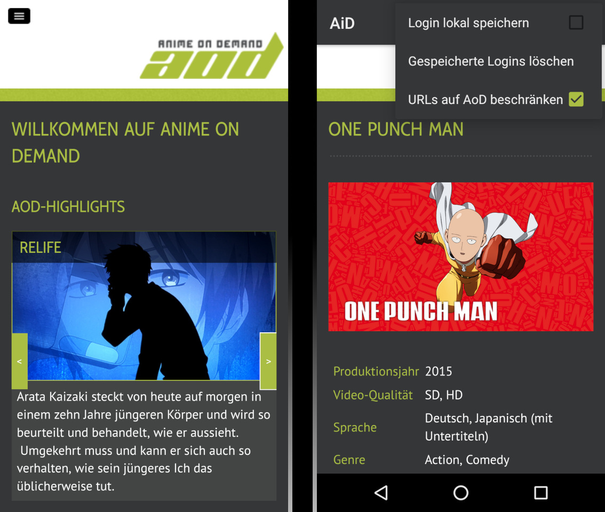

=====================
AiD: Anime in Deutsch
=====================

| Android App für „Anime on Demand“.
| Macht bequeme Verwendung auf Touchgeräten möglich und erlaubt es bei Bedarf
Logindaten lokal zu speichern.

AiD ist ein eigenständiges FOSS-Projekt unabhängig von AV Vision, Crunchyroll
und sonstiger an anime-on-demand.de beteiligter Aktuere.
Patches und andere Community-Beiträge sind willkommen.

.. contents:: Die wichtigesten Infos
   :depth: 2
   :local:
   :backlinks: none

Verfügbarkeit
=============

Eine Inklusion in das offizielle F-Droid Repository wird angestrebt.

Momentan wird dies noch durch Binärblobs in GeckoView verhindert (Analytics).
Dadurch wären Binärbuilds momentan auch nur von mir als momentan alleiniger
Urheber legal verbreitbar, da es mit den Binärblobs nicht möglich ist den
GPL-Bedingungen Genüge zu tun.
Es ist geplant den Buildvorgang anzupassen und aus den GeckoView-Quellcode eine
saubere Lib zu bauen und für die App zu verwenden.

Da ich keine Builds mit Binärblobs anbieten will, muss bei Interesse in der
Zwischenzeit die App selbst kompiliert werden, siehe weiter unten.

Screenshots
===========
..
  Some parsers are to dumb to handle resized images *sigh*
  .. image:: metadata/en-US/images/phoneScreenshots/1.png
     :alt: Screenshot 1
     :width: 49%
  -
  .. image:: metadata/en-US/images/phoneScreenshots/2.png
     :alt: Screenshot 2
     :width: 49%

Vergleich mit Alternativen
==========================

Im Verglich zur Benutzung der AoD-Webseite im Browser verfügt diese App über
ein paar Anpassungen um die Seite auf Touchgeräte benutzbar zu machen
*(viele Elemente auf der Webseite blockieren standardmäßig Scrollen für
Touchgeräte; das ist hier behoben)*.
Weiterhin ist es auf Wunsch möglich die Logindaten auf dem Gerät lokal zu
speichern.
Ansonsten ist diese App ein direkter GeckoView-Wrapper um die Webseite, bietet
also auch den gesamten Funktionsumfang jener.

Im Vergleich zur offiziellen App, die nach Animagic-Ankündigung 2018 zeitnah
zusammen mit dem neuem Design der Webseite veröffentlicht wurde, … …
Ohh, es gibt ja noch gar keine offizielle App, hupsi （。々°） .
Witzeleien beiseite, wie der Funktionsumfang AiDs sich im Vergleich mit
einer hypothetisch vielleicht irgendwann existierenden offiziellen App schlägt,
bleibt abzuwarten.

Ansonsten gibt es aus der Community noch ein `Kodi-Plugin für AoD`_; wenn du
ohnehin Kodi_ auf deinem Android-Gerät nutzt, sagt dir das womöglich mehr zu als
AiD, andernfalls wäre Kodi_ wohl etwas Overkill.
Wie sich AiD mit dem Plugin genau vergleicht kann ich mangels Erfahrung damit
nicht sagen.

Optionen
========

URLs auf AoD beschränken
------------------------
Standardmäßig *aktiviert*.
Mit dieser Option werden externe Links nicht in der App geöffnet sondern an den
Browser oder eine andere passende auf dem Gerät installierte App
weitergeleitet.

Login lokal speichern
---------------------

Standardmäßig *deaktiviert*.
Wenn dir AoDs eigenes „Login merken“ nicht genügt und aus irgendeinem Grund
Login-Manager, wie KeypassDX_, nicht in Frage kommen, können als Ultima Ratio
die Login-Daten lokal auf deinem Gerät im privaten App-Speicher gespeichert
werden. Damit werden E-Mail und Passwort beim Einloggen automatisch für dich
ausgefüllt, **nicht** jedoch im Formular zur Passwortänderung.

Wie immer wenn Logindaten lokal gespeichert werden hat das gewisse
Sicherheitsimplikationen. Das gilt nicht nur für AiD.
Wenn du aber nicht gerade einen gezielten Angriff auf dein Gerät befürchten
musst, mysteriöse APKs aus dubiosen Quellen installierst oder dein AoD-Passwort
dasselbe ist wie für deine Mail- und Finanzkonten, sollte das Risiko vertretbar
gering sein.
Genaueres darüber wie das Passwort von AiD gespeichert wird ist in Security_
nachzulesen.

Gespeicherte Logins löschen
---------------------------
Mit dieser Aktion werden alle gespeicherten Logindaten aus AiDs Einstellungen
auf dem Dateisystem gelöscht.

GeckoView selbst cacht einen verwendeten Login aber noch eine Weile, und zum
Zeitpunkt des Schreibens schient sich dieser Login-Cache noch nicht über die API
lösche zu lassen. Sollte das bei dir der Fall sein und die Logindaten auch nach
Geräte Neustart noch ausgefüllt werden, so kannst du um GeckoView zum Vergessen
zu zwingen, in den Android-Einstellungen (App → AiD) selbst den App-Cache
komplett löschen. Wenn du ganz super-duper sicher gehen willst, deinstalliere
die App einmal kurz.

Navigation
==========

Bei Start ist AiD im „Immersiven Modus“, dh Navigationsleiste, Appleiste und
Statusleiste sind ausgeblendet.
Durch Wischen vom oberen Rand nach unten oder vom unterem Rand nach oben werden
diese Elemente wieder eingeblendet.
So können die AiD-Einstellungen angepasst werden und bei Geräten ohne dedizierte
Naviagationstasten die App verlassen werden.
Um in den „Immersiven Modus“ zurückzukehren muss auf das Einklapp-Symbol
(Dreieck nach oben) in der Appleiste getippt werden.

Warum GeckoView?
================

Gegenüber dem ""normalen"" WebView bietet GeckoView viele zusätzliche
Möglichkeiten, sowohl durch die GeckoView-API, als auch durch den Umstand, dass
GeckoView Mozillas Gecko-Engine verwendet anstelle Googles Blink-Engine.
GeckoView erlaubt das laden von beliebigen standardkonformen Webextensions, was
essenziell für die benötigten Touch-Anpassungen ist und in Zukunft noch für
vieles andere verwendet werden kann. Auch das Speichern und automatische
Ergänzen der Logindaten wurde durch GeckoView stark erleichtert, da Google
eine ähnliche Möglichkeit ersatzlos aus der WebView-API gestrichen hat.

Da Android kein vernünftiges Packagemanagement für Libraries hat,
bringt die Verwendung GeckoViews allerdings auch Nachteile im Packaging mit
sich.
GeckoView statisch in die APK eingebunden werden, idR mit Versionen für
mehrere CPU-Architekturen auf einmal um portabel zu sein.
Das erhöht die APK-Größe bei so einer eigentlich simplen App erheblich und
bedeutet auch, dass um den Nutzern die Vorteile einer neuen GeckoView-Version
zukommen zu lassen, eine neue AiD-Version veröffentlicht werden muss — auch wenn
sich sonst an der AiD eigentlich nichts geändert hat.

Versionsnummern
===============

Die Versionsnummer besteht aus 3 Teilen: ``MM.mm.gg``.

``MM``
  zählt die größeren Änderungen seit der Erstveröffentlichung.
``mm``
  zählt die kleineren Änderungen AiDs und wird bei einem Wechsel der
  ``MM``-Nummer zurückgesetzt.
``gg``
  gibt Aufschluss über die GeckoView-Version.

Build
=====

*(Der Buildvorgang wird in Kürze noch angepasst um die in
Verfügbarkeit_ angesprochenen Probleme zu beheben)*

Leider ist für Android Gradle als Buildsystem quasi obligatorisch, daher wird es
auch hier verwendet.
Ich hatte keinen Erfolg mit den Gradle-Version in Debian-Buster, daher ist hier
für schnelle Builds eine binäre Gradle-Version im Repo (wird sich in Zukunft vl
ändern). Es werden weiterhin die Android SDK Tools benötigt.

Reproduzierbarer F-Droid Build
------------------------------
Noch in Arbeit, siehe Verfügbarkeit_.

Manueller Build
---------------
Kopiere ``local.properties.template`` nach ``local.properties`` und gib darin
den Pfad zu den Android SDK Tools an.
Danach sollte ``./gradlew build`` zum kompilieren ausreichen.

Android Studio
--------------
Den Ordner einfach als Projekt öffnen, Android Studio sollte die nötigen
Anpassung an die lokale Umgebung automatisch vornehmen und dann bereit zum
Kompilieren sein.

Lizenz
======

Der AiD-Code ist unter der GPLv3+ lizenziert.
Die verwendete GeckoView-Library wird unter der Mozilla Public License, v. 2.0
bereitgestellt.
Die Android SDK steht größtenteils unter Apache License 2.0.
Als Gesamtes steht das Projekt sowie die resultierenden Binärdateien unter der
GPlv3+.

.. _Security:  Security.rst
.. _KeypassDX: https://f-droid.org/en/packages/com.kunzisoft.keepass.libre/
.. _Kodi:      https://f-droid.org/en/packages/org.xbmc.kodi/
.. _`Kodi-Plugin für AoD`: https://github.com/kodinerds/repo/tree/master/plugin.video.aod
